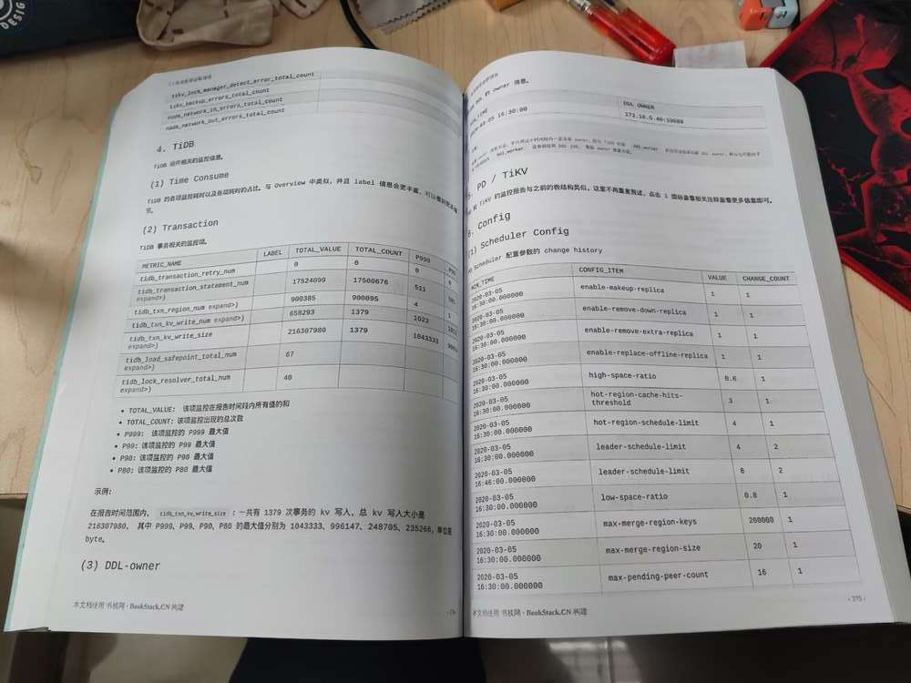

# TiDB 6.0 Book Rush！一起来分布式创作 6.0 的使用手册吧！

2020 年 3 月 TiDB 4.0 发布，48 小时分布式写一本书的疯狂念头把一群社区小伙伴聚在一起，造就了 TiDB 历史上第一本分布式创作的电子书—— 《[TiDB in Action](https://book.tidb.io/)》。这本书以 TiDB 4.0 版本为基础，介绍了 TiDB 的基本原理、安装部署与管理的实践，以及 Trouble Shooting 指南，是一本集合技术原理与实践指南的实用手册。这本书也成为了很多社区用户的 TiDB 入门指南，甚至有一些小伙伴默默地把它打印出来装订成册。

TiDB Book Rush 活动也铭刻在了很多社区小伙伴的记忆中，有人说“[这是数据库史上最浪漫的 36 小时](https://cdn.modb.pro/db/77946)”，让我们看到社区的力量如何将疯狂的想法变成现实。

如今，TiDB 刚刚发布了 6.0，在新版本中大幅度加强了 TiDB 的可管理性和可运维性，比如引入了数据放置框架（Placement Rules In SQL），增加了企业级集群管理组件 TiDB Enterprise Manager ，开放了智能诊断服务 PingCAP Clinic 的预览等等。在发布当天就已经有社区用户在 asktug 上表示已经或计划在测试了，如何帮助更多的用户把新版本中的这些“好用”的特性用起来呢？

作为一个开放、共享的社区，没有比“集结社区的力量编写一本 TiDB 6.0 的使用指南”更好的方式了！

4 月 22 日，TiDB 社区正式发起 TiDB 6.0 Book Rush 活动，面向社区征集 TiDB 6.0 的体验者和写作者，只要你有计划试用或正在试用 TiDB 6.0，都可以报名参加本次活动。在活动过程中，你将有机会和同期试用的小伙伴一起体验 TiDB 6.0 的最新特性（包含 TiEM 企业版特性），交流试用心得，最后将试用经验写成文章，你的经验会永久地留在 TiDB 的里程碑中，成为更多人学习 TiDB 的宝贵资料。当然，还有丰富的周边奖励和积分等你拿！

TiDB 6.0 Book Rush 将分为 TiDB 6.0 原理和特性，TiDB Developer 体验指南，TiDB 6.0 可管理性，TiDB 6.0 内核优化与性能提升，TiDB 6.0 测评，TiDB 6.0 使用实践 6 大内容模块，你可以选择自己感兴趣的任一模块，来试用和撰写相关文章。

## 活动安排

- 试用报名，时间：4 月 22 日- 6 月 10 日

  - 填写试用意愿表单：https://forms.pingcap.com/f/BookRush

    > 报名后 1-2 个工作日会拉群，如果超过 3 个工作日没有人找你，证明审核没通过，如有任何疑问，可以加罗伯特微信咨询：

- 试用 & 反馈阶段，时间：截至 6 月 17 日

  - 根据试用引导资料，下载和部署 TiDB 6.0，对相应的特性进行功能、性能、可靠性等方面的专项测试，并填写和提交试用反馈报告；

- 文章创作阶段，时间：截至 6 月 30 日

  - 根据电子书目录认领章节，在社区专栏撰写和提交 TiDB 6.0 试用文章，获得相应的权益奖励；

- 结果公布
  - 7 月 22 日前将在 asktug 公布结果，并在 PingCAP DevCon 2022 颁奖

## 多重权益

**权益一：TiDB 社区 100 经验值&积分**

- 填写意愿表，报名成功即可获得

**权益二：PingCAP DevCon 2022 门票、磁带无线移动电源、TiDB 社区 200 经验值&积分**

- 报名，完成测试并提交反馈报告，反馈报告通过审核即可获得

> “PingCAP DevCon”是由 PingCAP 举办的年度顶级数据技术盛会，大会已连续举办三年，成为观测开源产业、数据库前瞻趋势的风向标。

**权益三：TiDB 6.0 Book Rush 优秀贡献者，并在 DevCon 荣誉展示**

- 完成测试，撰写测试体验类技术文章，文章入选 TiDB 6.0 Book Rush 即可获得
- 奖励：TiDB Community 键盘，300 积分&经验值

**权益四：TiDB 6.0 荣誉体验官（限额 10 名），并在 DevCon 2022 现场颁奖**

- 文章入选 TiDB 6.0 Book Rush，并获得精选推荐即可获得

- 奖励：Apple Watch Series 7，还有机会在 PingCAP DevCon 2022 做主题分享

- 精选标准：

1. OLTP 或 HTAP 的主题方向优先；
2. 重点体验 feature 的真实使用感受优先；
3. 应用场景的可复制性强，文章中有关于收益/价值总结的描述；

## 试用工具包

1. TiDB 6.0 软件包下载链接：https://pingcap.com/zh/product-community/
2. TiDB 6.0 Release Notes：https://docs.pingcap.com/zh/tidb/v6.0/release-6.0.0-dmr
3. 升级指南（使用 TiUP 升级到 TiDB 6.0）：https://docs.pingcap.com/zh/tidb/v6.0/upgrade-tidb-using-tiup
4. TiFlash 快速上手指南：https://asktug.com/t/topic/632816
5. TiEM 试用指南：https://asktug.com/t/topic/664213
6. Clinic 试用指南：https://asktug.com/t/topic/664214
7. TiDB 学习资料大全：https://asktug.com/t/topic/664024

## 试用范围

本次试用范围为 TiDB 6.0.0-DMR 版本，主要特性包括：

- TiDB Enterprise Manager 企业级数据库管理平台（TiEM）；

- PingCAP Clinic 自动诊断服务（Technical Preview 版本）；

- Placement Rules：基于 SQL 的数据放置规则，提供更灵活的数据放置管理能力；

- 最新版本分析引擎 TiFlash：更多算子和函数支持，更优的线程模型，更高效的列存引擎；

- TiDB  6.0 其他新增小特性
  - 特性1：支持手动取消统计信息的自动更新，减少资源争抢，降低对业务 SQL 性能的影响；

  - 特性2：内核层面的数据索引一致性检查，通过极低的资源开销提升系统稳定性和健壮性；

  - 特性3：面向非专家的性能诊断功能 Top SQL，提供一体化、自助的数据库性能观测及诊断能力；

  - 特性4：支持持续性能分析，持续记录集群的故障现场性能数据，缩短技术专家故障诊断时间；

  - 特性5：热点小表缓存，大幅提高访问性能，提升吞吐，降低访问延迟；

  - 特性6：内存悲观锁优化，在悲观锁性能瓶颈下，可以有效降低 10% 延迟，提升 10% QPS；

  - 特性7：提升 MPP 引擎计算性能，支持更多表达式下推，正式引入弹性线程池；

  - 特性8：新增 DM WebUI，方便地通过图形化的方式管理大量迁移任务；

  - 特性9：提升 TiCDC 在大规模集群下同步数据的稳定性和资源利用效率，支持高达 10 万张表的同时同步；

  - 特性10：TiKV 节点重启后 leader 平衡加速，提升业务恢复速度。

## Book 地址

我们已经初拟了[电子书大纲](https://tidb.net/book/book-rush/)，你可以根据兴趣和需求来认领要创作的部分。

电子书地址：https://tidb.net/book/book-rush/

## License

This work is licensed under a [Creative Commons Attribution-NonCommercial-ShareAlike 4.0 International License](https://creativecommons.org/licenses/by-nc-sa/4.0/).
